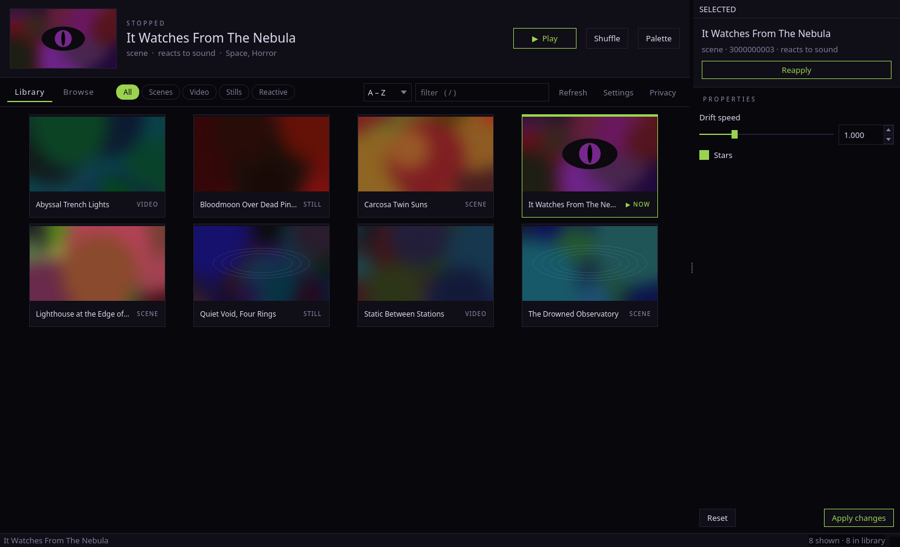
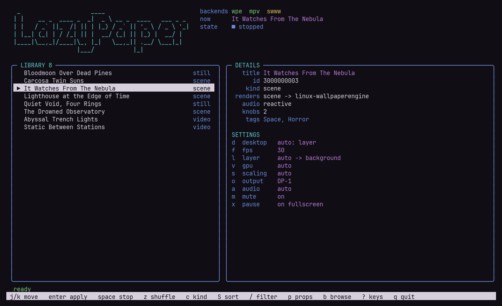

# fossypaper-engine

[](https://github.com/paladiga484/fossypaper-engine/actions/workflows/ci.yml)


**Wallpaper Engine wallpapers on Linux, set as a real wallpaper.** Scenes,
videos and stills from your Steam Workshop library, on Hyprland, niri, sway,
KDE Plasma, GNOME and bare X11 window managers. It comes with a desktop app, a
terminal app and a CLI, and it has two rules it won't bend:
**nothing listens** (no port, no local server, no daemon) and **no telemetry**.





<sub>Screenshots come from a generated demo library (`scripts/screenshots.sh`),
not anyone's Workshop art.</sub>

## What you get

- **`fossypaper`** — the desktop app: thumbnail library, a live property editor
  built from each wallpaper's own schema, a built-in Wallhaven + Steam Workshop
  browser, and flat themes (including four horror ones) you can change.
- **`lazypaper`** — the same thing in the terminal, drawn in your terminal's
  own colours. From a launcher it opens its own window with app-id `lazypaper`,
  so it works with launchers that ignore `Terminal=true`, and a window rule can
  float it (`fossypaper doctor` prints one for niri and one for Hyprland).
- **`fossypaper <cmd>`** — the CLI everything else is built on, with `--json`
  on every listing.
- **Noctalia plugin** — bar widget, library panel, control-centre tile and a
  `/wp` launcher provider. See [`noctalia-plugin/fossypaper`](noctalia-plugin/fossypaper/README.md).
- **Plasma wallpaper type** — on KDE the wallpaper is registered with Plasma
  (it shows up in *Configure Desktop → Wallpaper type*) instead of floating
  over your desktop icons.

## Install

**Arch / CachyOS / Manjaro** — build the package from [`packaging/arch`](packaging/arch):

```
git clone https://github.com/paladiga484/fossypaper-engine
cd fossypaper-engine/packaging/arch && makepkg -si
```

**Anywhere else**, or to run from a checkout (everything goes under `$HOME`, no root):

```
./install.sh
```

Then:

```
fossypaper doctor     # what's here, what's missing, and what each piece buys you
```

You need `PySide6` and `Pillow`. The renderers depend on your desktop, and
`doctor` tells you which ones matter on yours:

| Desktop | Install |
| --- | --- |
| Hyprland, niri, sway… | `linux-wallpaperengine` for scenes, `mpvpaper` for video, `swww` optional for stills |
| KDE Plasma | `qt6-multimedia` for video, `qt6-tools` for `qdbus6`; optionally `wallpaper-engine-kde-plugin-git` for live scenes |
| GNOME | the [Hanabi] extension for video (optional) |
| X11 window manager | `linux-wallpaperengine`, `xwallpaper` or `feh`, `xwinwrap` + `mpv` for video |

`ffmpeg` (palettes and stills from videos) and `steamcmd` (Workshop downloads
from inside the app) are optional everywhere.

## How it becomes *the* wallpaper

A wallpaper has to be drawn by whoever owns the desktop background, or it ends
up as a window sitting on top of your icons. `host` (Settings → Render →
Desktop, `d` in lazypaper) picks who that is. `auto` reads the session:

| Desktop | How it's set | Scenes | Video | Stills |
| --- | --- | --- | --- | --- |
| Hyprland, niri, sway, river… | layer-shell surface | live | live | live |
| KDE Plasma (Wayland or X11) | fossypaper's own Plasma wallpaper type | live with the native scene renderer*, else a still frame | live (QtMultimedia) | live |
| GNOME | `org.gnome.desktop.background` | still frame | live with the [Hanabi] extension, else a still frame | live |
| X11 window managers (i3, bspwm, openbox…) | the root window | live | `xwinwrap` + `mpv` | `xwallpaper` or `feh` |

\* Optional. `wallpaper-engine-kde-plugin-git` (AUR, RainyPixel's Plasma 6
port, no Python helper). fossypaper imports **only its compiled `SceneViewer`
type**; without it, scenes show a still frame and everything else works. Build
it pinned to a commit you've read (`#commit=` on its `source=` line) — a `-git`
package otherwise builds whatever was pushed last. Avoid the older
`plasma6-wallpapers-wallpaper-engine-git`: its upstream was archived in May 2026,
and its "Wallpaper Engine for Kde" type runs a Python helper with an
**unauthenticated local WebSocket server** that will read or delete files.
`fossypaper doctor` warns about this too.

On layer-shell, `layer: auto` means `background`, which is a true wallpaper.
If a shell that draws its own backdrop is running (Noctalia/iNiR/Quickshell,
swaybg, hyprpaper), fossypaper goes one layer up to `bottom` so it doesn't
fight that backdrop. Turn the shell's own wallpaper off and it's a plain
background again. On niri, `doctor` prints the `place-within-backdrop` layer
rule that keeps it visible in the overview.

GNOME's Mutter has no layer-shell, so nothing can render a live scene there.
The still frame is the best anyone can do without a GNOME Shell extension.

## What it renders

On layer-shell compositors and X11 (Plasma and GNOME draw it themselves, as above):

| Wallpaper Engine type | Rendered by | Notes |
| --- | --- | --- |
| `scene` (`scene.pkg`, `gifscene.pkg`) | `linux-wallpaperengine` | including scenes with video layers |
| `video` | `mpvpaper` | hardware decode, paused behind fullscreen apps |
| `image` | `swww`, or `mpvpaper` if you don't have it | also what Wallhaven downloads become |
| `web` | nothing, on purpose | it would need a local web server; see below |
| `application` | nothing | it's a Windows executable |

The type comes from each wallpaper's `project.json`, along with the file the
renderer should actually open — so `gifscene.pkg`, video files with spaces in
their names, and libraries that aren't Steam's all work without special cases.

Libraries are searched in this order, and the first one to define an id wins:
Steam's workshop dir, the Flatpak Steam equivalent, and fossypaper's own
downloads. Set `FOSSYPAPER_LIBRARY` (colon-separated, like `PATH`) to replace
that list entirely.

## Per-wallpaper properties

Wallpaper Engine wallpapers ship their own settings schema — a 4K terminal
wallpaper in this library has 77 of them. fossypaper reads that schema straight
out of `project.json`: types, ranges, combo labels, defaults, and the
`condition` expressions that decide when a knob is even relevant. Knobs whose
condition isn't met are hidden, the way the original hides them.

```
fossypaper props 3634342477            # what this one exposes
fossypaper props 3634342477 --all      # including the hidden and the decorative
fossypaper set-prop 3634342477 theme=4 efeitovhs=true
```

The GUI dock and the TUI's `p` view are the same data with widgets on it.

## Audio

`--silent` mutes a wallpaper's output. It does **not** stop audio *processing* —
the renderer keeps a capture stream open on your sink monitor, and those
accumulate across reapplies until something latency-sensitive starts to
struggle.

So `audio_processing` defaults to `auto`: capture only for wallpapers whose own
manifest declares `supportsaudioprocessing`. In a library of forty, that was
eighteen. `always` restores the original behaviour, `never` disables it outright.

## Games

A wallpaper carries on rendering behind a fullscreen game unless something stops
it. `fullscreen_pause` is on by default for both backends. Loosen it per app:

```
fossypaper config --set fullscreen_pause=true pause_only_active=true
fossypaper config --set pause_ignore_appids=mpv,vlc
```

## The browser

`Browse` in the app, `b` in the TUI, or:

```
fossypaper browse wallhaven "eldritch"
fossypaper browse workshop "cosmic horror"
fossypaper get 2500458873          # a Workshop id
fossypaper get wqokqq              # a Wallhaven id
```

Wallhaven stills are downloaded straight into your library. Workshop items are
Steam's to serve: with `steamcmd` installed fossypaper fetches them, and without
it hands the item to Steam so you can subscribe there. Wallhaven matches tags,
so one or two words beat a sentence.

## Colours

`fossypaper theme` renders a frame of the current wallpaper, clusters its
pixels, and writes the palette to `~/.local/state/fossypaper/colors.{json,sh,css}`
in a pywal-compatible shape. `matugen`, `wallust` and `wal` are used instead
when you have them and ask for them. The GUI can follow the same palette
(Settings → Appearance).

## Multiple screens

`output` blank means every connected screen. `span` stretches one wallpaper
across several. Output names come from the compositor — `hyprctl`, `niri`, then
`wlr-randr`, then DRM — because a MUX switch can rename the panel and
`--screen-root` only accepts the name the compositor is using.

## Privacy

fossypaper opens **no listening socket**: no port, no local server, no helper
daemon. The Noctalia plugin talks to it by running `fossypaper --json <cmd>` and
reading stdout, and that is the only mechanism offered. On Plasma it acts as a
D-Bus *client*: it calls plasmashell's own `evaluateScript` to select its
wallpaper type and write that type's config, and exposes nothing itself. That is also why `web`
wallpapers are unsupported rather than faked.

Outbound requests happen only when you use the browser, and only to the five
hosts named in [`docs/PRIVACY.md`](docs/PRIVACY.md) — which lists exactly what
is sent to each. `fossypaper privacy` prints it; `--terms` prints
[`docs/TERMS.md`](docs/TERMS.md).

## Commands

```
fossypaper list [--json] [--usable-only] [--type T] [--search Q] [--thumbs]
fossypaper apply <id> · off · toggle · status
fossypaper props <id> [--all] · set-prop <id> KEY=VALUE...
fossypaper browse wallhaven|workshop [query] [--page N] [--sort S]
fossypaper get <id>
fossypaper theme [id] [--backend builtin|matugen|wallust|wal]
fossypaper config [--set KEY=VAL...] [--reset]
fossypaper autostart on|off · daemon · sddm [id]
fossypaper doctor · privacy [--terms]
fossypaper gui · tui
```

## Project layout

```
fossypaper/
  engine/        the backend: no Qt, no curses, tested headless
    library.py     roots, project.json, presets, scene packages
    session.py     compositor, outputs, GPU/EGL, who owns the background
    render.py      routing and the layer-shell renderers
    plasma.py      the Plasma wallpaper type, over plasmashell's D-Bus
    gnome.py x11.py  the other hosts
    media.py colours.py service.py  stills and thumbnails, palettes, autostart
  app.py         the Qt app          tui.py     lazypaper
  cli.py         the CLI             sources.py Wallhaven + Workshop
plasma-wallpaper/  the Plasma wallpaper type (plain QML)
noctalia-plugin/   the Noctalia plugin (Luau)
packaging/arch/    PKGBUILD
scripts/           demo library + screenshot generator
```

## Contributing

```
python3 -m unittest discover -s tests       # headless; no Qt, no renderer needed
python3 -m pyflakes fossypaper tests
noctalia plugins lint noctalia-plugin/fossypaper
```

CI runs the first two on Python 3.10, 3.12 and 3.14. The two rules above are
not up for debate: a change that needs a listening socket, a local server, a
helper daemon or any phone-home won't be merged, however useful it is. That
is also why `web` wallpapers stay unsupported.

## Not affiliated with Wallpaper Engine

Wallpaper Engine is a commercial product by Kristjan Skutta. fossypaper is an
independent program that renders some of the same content through
`linux-wallpaperengine` and other open renderers. MIT licensed; see
[`LICENSE`](LICENSE).

[Hanabi]: https://github.com/jeffshee/gnome-ext-hanabi
